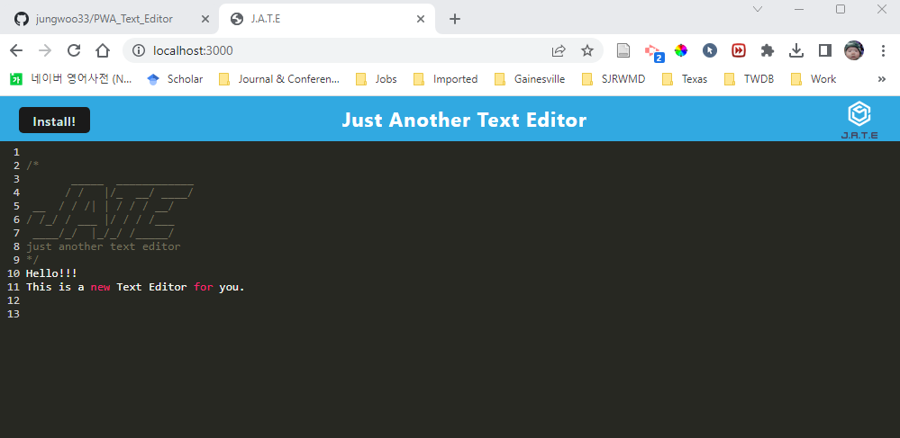

# Progressive Web Applications (PWA)
  

## 1. Table of Contents:
This readme file includes the following contents:
+ [Description](#2-description)
+ [Installation](#3-installation)
+ [Usage](#4-usage)
+ [License](#5-license)
+ [Application results](#6-application-results)
+ [Questions](#7-questions)

## 2. Description: 
This app is a text editor that runs in the browser that meets the PWA criteria. Additionally, it will feature a number of data persistence techniques that serve as redundancy in case one of the options is not supported by the browser. The application will also function offline.

## 3. Installation:
Please make sure to have following programs installed on your computer to use this app:
+ VS Code
+ GitBash
+ Node.js
+ IndexedDB (idb)

To use this program, `git clone` the repo down to your local. Then, run `npm install` in order to install the `npm` package dependencies as specified in the `./package.json`. Now, you are ready to go!

## 4. Usage:
To use this application, follow the instruction below: 
+ First, run `npm install` on your terminal, then it will install the required `npm` packages.
+ Second, run the application: 
  + `npm run start`: This will run the application. 

## 5. License:
### The MIT License
  

## 6. Application results:
[GitHub:] https://github.com/jungwoo33/PWA_Text_Editor 
[Heroku:] https://serene-reaches-41593.herokuapp.com/ 
The screenshot of the editor looks like this: `./assets/Screenshot.png` -  

## 7. Questions?:
If you have any questions, feel free to contact me via information below: 
[GitHub:] https://github.com/jungwoo33 
[Email:] jungwoo33@gmail.com

- - -
© 2023 Jungwoo Lee. Confidential and Proprietary. All Rights Reserved.